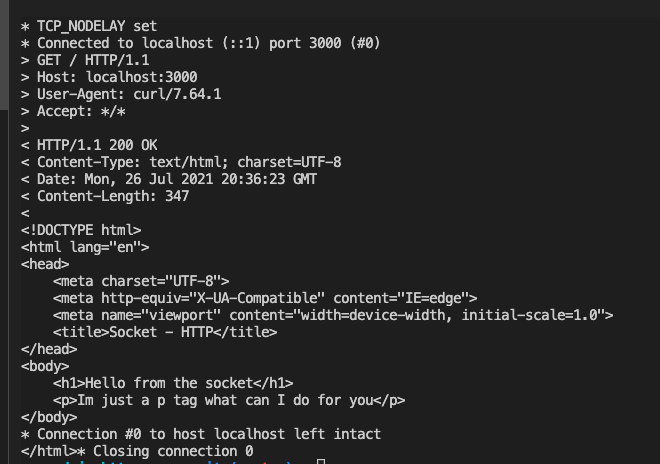

# NODEJs Basic HTTP Server

This short exercise to create a basic HTTP server from the built-in `net` module (without the `http` module). It only parses `GET` requests to root and returns a very basic `index.html`.

## The Server

Using the `net` module, we can create a server by using `createServer()`. We can then listen for events on the server. Used in this exercise: `connection` and `error`. 
The `connection` event gives access to the socket in its callback function.

## The Socket

Inside the `connection` server event, we can listen to events on the socket. 
The `data` event (on the socket) is where most of the code was written. Inside the callback, the data sent by the client is available as an argument. We only need to parse this argument (the *request*) and write the *response* to the socket. 
This exercise is very basic and only works for `GET` requests on `/`, and send a few HTTP headers before sending the contents of `index.html` in the body. Each header must have `\r\n` at the end of the line in order to get used properly.  

## Example

Running `curl http://localhost:3000/ -v`, we get:  
